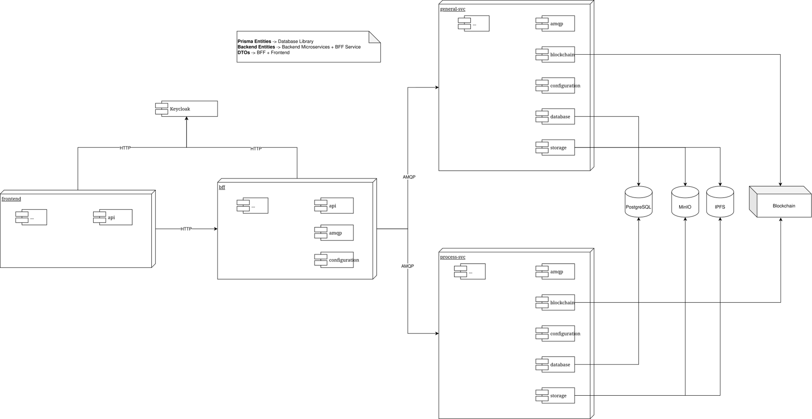

[[chapter-components]]
:docinfo: shared
:toc: left
:toclevels: 3
:sectnums:
:copyright: Apache-2.0
:projectName: H2-trust

= Components of {projectName}

This chapter describes the individual components of the {projectName} and their functions.

== Overview

{projectName} comprises several microservices. These include the general-svc, which handles the storage of machine and customer data. There is also the process-svc. This is likewise a NestJS service that handles the creation of new processes for the process chain and also calculates emissions data. We also have a bff, which acts as the interface to the backend services. All three services are NestJS services. To visualise the information, there is also an Angular frontend.

== General-svc

The general-svc is a custom-developed web service that stores data on customers, companies and the devices used for the processes. Essentially, this service is solely responsible for storing this data in the database. It is also used to create and accept power purchase agreements. These are used to gain access to another user’s power-generating units. This allows power purchase agreements to be created and accepted by the user concerned. However, there is no complex business logic here, it has been outsourced to the process service.

The general-svc is a NestJS microservice that accepts requests via an AMQP interface and communicates with the process-svc, also via AMQP.

== Process-svc

Like general-svc, process-svc is a NestJS web service, but one that primarily handles the business logic. This is where new process steps are generated, which can be tracked via the process chain. It distinguishes between production process steps that introduce new H2 batches into the system and process steps, such as bottling and compression, that utilise these batches further.

When setting up new h2 productions, the hydrogen to be produced is matched against the available electricity. If there is not enough electricity available for production, grid electricity is used. This, in turn, affects the quality of the hydrogen produced in terms of its emission levels.

Produced hydrogen forms the basis of every process chain and always marks the start of such a chain. Building on this, further process steps can be created to process the produced H₂ batches. There is no fixed order for these further process steps. It is the user’s responsibility to ensure that the chain makes sense.

Another key component of process-svc is the calculation of the proof of origin, proof of sustainability and RFNBO value. This data is based on the recorded emission values generated at each individual process step and provides insight into the quality of the entire chain. This therefore makes it possible to determine whether a process chain complies with specific emission targets and, if this is not the case, to identify where in the process chain the cause lies.

== BFF

The BFF is also a Nest.js service, although it receives its requests via REST. Its role is to forward the request to the appropriate endpoints of the backend services. The results from the backend services are then aggregated and formatted accordingly. The BFF is designed to act as an intermediary between the frontend and backend services.

== Frontend

The front end was built using Angular. It handles the display of the h2-trust functionality. It allows production data to be uploaded as a CSV file. This data can then be displayed and matched within the front end to generate new H2 productions. These H2 productions are assigned to the unit that produced them. Further process steps can then be added to the process chain; however, the batches from the preceding process steps are never explicitly selected, instead, only the desired quantity of H2 and the unit that produced the preceding batches are specified.
The front end then offers the option to view the entire chain for specific process steps and to examine the emissions generated at all nodes.

== Blockchain Integration

In this project, a blockchain is used to secure stored files that are imported to specify an H2 production. To this end, a hash value is calculated for the uploaded file and stored on the blockchain via a custom-built smart contract. The blockchain can either be self-hosted (e.g. Hyperledger Besu) or a public blockchain can be used (e.g. Arbitrum). The only important thing is that the blockchain is compatible with the smart contract, which is written in Solidity.

The blockchain feature can be disabled via an environment variable. If this feature is disabled, all functions remain available, with the exception of the additional security provided by the blockchain.

== IPFS Integration

An IPFS integration was implemented as a counterpart to the blockchain-based security measures. Whilst the blockchain allows verification of the stored CSV files detailing the hydrogen produced, IPFS enables these files to be stored in a distributed manner. This makes it possible to restore the original data in the event of tampering, provided the data is stored in a distributed manner within the IPFS system.

Just as with blockchain integration, IPFS integration can be disabled.

== Error Handling

Error handling works by distinguishing between different types of errors, which are then interpreted appropriately. Domain Exceptions are thrown to indicate a problem with the processing of data relating to the business logic. InternalExceptions and ValidationExceptions occur when the input data is not in the correct format. Blockchain and Database Exceptions occur when an error arises in these specific areas.

== Testability
Unit tests are carried out to ensure test coverage. This approach is based on the testing methods typically used in Node.js and Angular. The unit tests are located alongside the files they test and are named with the .spec extension.
