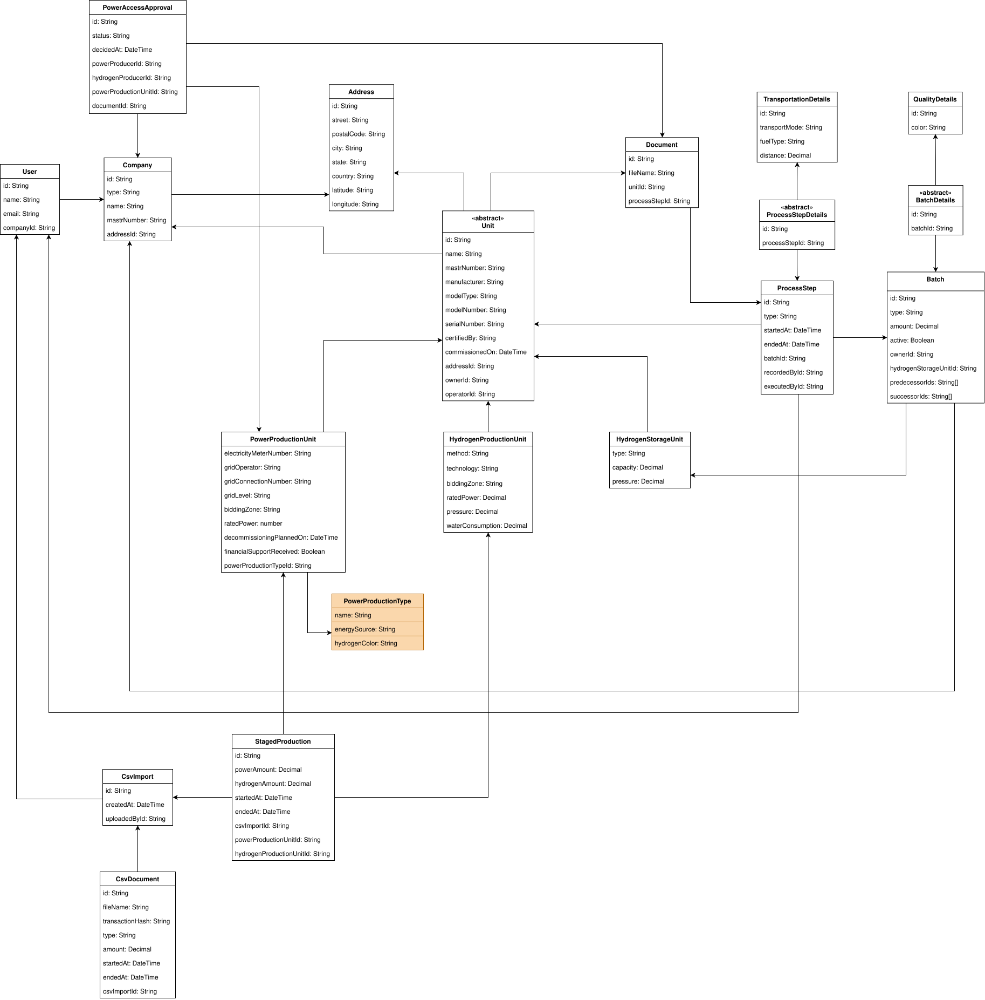

[[chapter-building-block-view]]
:docinfo: shared
:toc: left
:toclevels: 3
:sectnums:
:copyright: Apache License 2.0

= Building Block View

The building block view is a static and hierarchical decomposition of the system into building blocks and their relationships.
It is a collection descriptions for all important components.
Building blocks may be modules, components, subsystems, classes, interfaces, packages, libraries, frameworks, layers, partitions, tiers, functions, macros, operations, data structures, etc.).

For interface specifications, including all method signatures and their descriptions, we refer to the _OpenAPI_ documents.
Only other kinds of interfaces are described here.
This is a simplification of arc42 (which requires a short description of interfaces), to avoid redundancy and inconsistencies, and to reduce documentation efforts.

== Overview

The H2-Trust project mainly consists of two parts: a frontend and a backend.
The frontend is a web interface for the user and was developed using Angular.
The backend consists of an API gateway, which is responsible for routing requests from the frontend to the corresponding service, and a number of services, which provide the business logic. All three backend applications are implemented using TypeScript and Node.js.
Additionally, the backend utilizes a database, an object storage system, and a blockchain for data storage.

image:images/system-architecture.svg[]

== Building Blocks - Level 1

In level 1, the components of H2-Trust are shown.

[cols="1,1,3",options="header"]
|===
| Name
| Status
| Responsibility / Description

| Frontend
| Custom development
| The frontend is the user interface of the project. All actions such as batch creation are carried out from here and all saved data can be viewed.

| Backend for Frontend
| Custom development
| The service that receives the interface calls from the frontend and forwards them to the other services.

| General service
| Custom development
| The general service is responsible for managing master data such as units, companies and users. This includes the creation, fetching and possible updating of these objects. It also contains the logic for creating and confirming power purchase agreements.

| Process service
| Custom development
| The process service handles all tasks related to process steps. This involves creating new H2 production schedules by combining information from CSV files containing the planned H2 production and the electricity available at that time. Further process steps can be generated on the basis of the H2 production schedules created. In addition, reports on emissions are generated here.

| Message-broker
| Message-broker software
| The service that connects all services from the API service onwards.

| Postgres database
| Relational database management system
| All information is stored non-temporarily here.

| MinIO File Storage
| Object storage system
| Documents such as certificates are stored here.

| Keycloak
| Single sign-on system
| An authorization service with which user logins are implemented and managed.

| Arbitrum/Besu
| Blockchain
| An Ethereum-based blockchain used to secure the uploaded CSV files containing production data via a hash. This makes it possible to detect any subsequent alterations to the version stored on the MinIO file storage system.

| Filebase/kubo
| Single sign-on system
| An IPFS node that distributes, stores and makes the uploaded CSV files accessible.
|===

== Building Blocks - Level 2

In Level 2, the internal components of the above are shown.

=== Frontend

|===
|Component Collection |Component |Description

.3+|**Units**
|Overview View
|An overview of all the units belonging to the logged-in user. The units can be sorted by type.

|Details/Update View
|Displays the details of a specific unit. The fields for each unit vary depending on the type of unit. The saved data for the units can be edited, and the unit can be deactivated.

|Create View
|Provides the ability to specify data for a new unit and use that information to create a new unit.

.4+|**Productions**
|Production Overview View
|An overview of all in-house H2 productions. The list displays the amount of H2 for each H2 batch, as well as the electricity consumption and the RFNBO classification. It also includes statistics providing information about all in-house H2 productions. The list of productions can be filtered by ID or date.

|Upload Overview View
|Displays all files that were uploaded by the user. For each file, it shows the type of production (H2 or electricity) and the total amount produced. If blockchain validation is enabled, this interface can be used to verify whether the stored CSV file is identical to the one that was initially uploaded.

|Upload View
|Allows you to upload new CSV files that can be used to create new H2 productions. In addition to uploading the CSV files, you must select the unit that will carry out the specified production.

|Production Select View
|Displays the H2 productions available via the uploaded CSV files. These productions can be selected, after which the corresponding available power productions are displayed. You can then select from these and confirm the match. A new H2 production is then created and displayed in the Production Overview view.

.3+|**Batches**
|Overview View
|An overview of all the batches belonging to the logged-in user. The batches can be sorted by type and id.

|Add Batch View
|Allows you to enter information to create a new process step and add it to the process chain. To do this, you must select the unit from which the predecessor batches are to come. These predecessor batches are displayed at the top of the page.
In addition, you must specify the type of the newly created process step and, depending on the type, document any resulting emissions.

|Digital Product Passport View
|Indicates whether a specific process step complies with RFNBO. This page also shows the complete process chain up to the currently selected process step, as well as the corresponding emission values for each account point.

.1+|**Power Purchase Agreement**
|Overview View
|Displays all power purchase agreements that have been sent and received. It distinguishes between open requests and completed requests. Enables the creation of a new PPA via a form into which the necessary details must be entered.

.1+|**Account**
|Overview View
|Displays all power purchase agreements that have been sent and received. It distinguishes between open requests and completed requests. Enables the creation of a new PPA via a form into which the necessary details must be entered. Displays information about the currently logged-in user. This includes personal details and information about the associated company.

|===

=== Backend for Frontend

|===
|Component Collection |Component |Description

.2+|**Company**
|Company Controller
|Provides REST endpoints that enable the retrieval of companies.

|Company Service
|This service calls the corresponding AMQP endpoints.

.2+|**File Download**
|File Download Controller
|Provides REST endpoints that enable the downloading of uploaded CSV files.

|File Download Service
|This service calls the corresponding AMQP endpoints.

.2+|**Power Purchase Agreement**
|Power Purchase Agreement Controller
|Provides REST endpoints that enable the creation, viewing and updating of Power Purchase Agreements.

|Power Purchase Agreement Service
|This service calls the corresponding AMQP endpoints.

.2+|**Process Step**
|Process Step Controller
|Provides REST endpoints that enable the creation and retrieval of process steps. Also provides endpoints for retrieving emissions data.

|Process Step Service
|This service calls the corresponding AMQP endpoints.

.2+|**Production**
|Production Controller
|Provides REST endpoints that enable the creation and retrieval of draft production process steps. It also allows draft process steps to be linked to new productions. Furthermore, it provides endpoints for retrieving production steps and the associated statistics.

|Production Service
|This service calls the corresponding AMQP endpoints.

.2+|**Unit**
|Unit Controller
|Provides REST endpoints that enable the creation, updating and reading of units.

|Unit Service
|This service calls the corresponding AMQP endpoints.

.2+|**User**
|User Controller
|Provides a REST endpoint that enables the reading of user information.

|User Service
|This service calls the corresponding AMQP endpoints.

|===

=== General Service

|===
|Component Collection |Component |Description

.2+|**Company**
|Company Controller
|Provides AMQP endpoints that enable operations such as creating or reading companies.

|Company Service
|This service offers functionalities such as creating or reading companies.

.2+|**Power Purchase Agreements**
|Power Purchase Agreement Controller
|Provides AMQP endpoints that enable operations such as creating, updating or reading power purchase agreements.

|Power Purchase Agreement Service
|This service offers functionalities such as creating, updating or reading power purchase agreements.

.2+|**Units**
|Unit Controller
|Provides AMQP endpoints that enable operations such as creating, updating or reading units.

|Unit Service
|This service offers functionalities such as creating, updating or reading units.

.2+|**User**
|Unit Controller
|Provides an AMQP endpoints that enables to read user information.

|Unit Service
|This service offers functionalities to read user information.

|===

=== Process Service

|===
|Component Collection |Component |Description

.5+|**Digital Product Passport**
|Proof Of Origin
|Provides functions that build the process chain starting from a specific process step. It categorises the information relating to the individual process steps into different classifications, thereby enabling users to view key nodes along the process chain and calculate the emissions they generate.

|Proof of Sustainability
|Provides functions that calculate the emissions caused by the process step. Each process step type has its own emissions calculation. In the calculation, we distinguish between fixed values, which are generated by the executing unit, and variable values, which are specified when the process is created. The unit’s emission values are permanently linked to the unit and are scaled down during the calculation to the H2 quantity of the process step. These values, in combination with the variable values, then determine the emissions generated per process step. These are returned together with the calculation.

|Provenance
|In order to establish a basis for calculating Proof of Origin and Proof of Sustainability, the entire process chain is first retrieved from the database. This process chain is then encapsulated in a provenance object. This provenance object is used as input for many functions to calculate specific key performance indicators for the digital product passport.

|Red Compliance
|The Red Compliance calculation involves a series of requirements that must be met during hydrogen production in order to obtain RFNBO-compliant hydrogen. These criteria are checked, and the hydrogen batches produced are then classified accordingly.

|Digital Product Passport Service
|The Digital Product Passport Service uses results from the Proof of Origin, Proof of Sustainability and Red Criteria calculations to gather information about the quality of the hydrogen at the process step in question. This information is returned as a Digital Product Passport object.

.4+|**Process Step**
|Bottling Allocator
|It accepts as input the hydrogen batches to be created and the currently available batches from which these new batches are to be created. The Bottling Allocator calculates which batches are to be used to create the new batches, which batches need to be set to Inactive, and which batches need to be split. If a batch needs to be split, a new batch is created with the remaining quantity and the old batch is set to Inactive.

|Hydrogen Composition
|The hydrogen composition service is used to calculate the total amount of RFNBO and non-RFNBO hydrogen. To do this, a number of batches are grouped according to their RFNBO value, resulting in exactly two batches (one for RFNBO and one for non-RFNBO), each containing the total amount of the respective RFNBO class.

|Process Step Validator
|Different process steps require different input data. The Process Step Validator checks whether all the necessary data is available for the process type to be created.

|Process Step Service
|The Step Service process handles all functions relating to the creation of new process steps or to reading process steps. The functions for paginating process steps are also carried out here.

.4+|**Production**
|CSV
|The CSV Services are used to upload new CSV files and store the information in the database as provisional production data. The new CSV files are also stored on the minIO server. Furthermore, the uploaded files are hashed, and this hash is stored on the blockchain along with a reference to the stored file. This service is also used to verify these files at a later date.

|Production Utils
|The production utils service is used to scale down the data from the uploaded production data to hourly time slots. This is necessary in order to carry out the matching of hydrogen and electricity production at a later stage. The amount of hydrogen or electricity produced is also scaled down in the process. 

|Production Staging Service
|The production staging service is responsible for creating provisional production batches. These batches can then be merged if they are compatible in terms of the energy produced or required and occur within the same time slot. Once two suitable provisional batches have been selected, they are set to inactive and a new hydrogen production batch is created.

|Production Normalizer
|As it is possible that there may be provisional production batches that occur within the space of an hour but are carried out by the same machine, these batches must be normalised to a one-hour slot. So, for example, if a preliminary production run from 13:00 to 13:30 and another from 13:30 to 14:00 were carried out by the same machine, we replace these two batches with a single batch running from 13:00 to 14:00, with the total amount of hydrogen produced by both batches constituting the quantity of this new batch. The Production Normalizer handles this calculation.

|Production Assembler
|The production assembler creates new hydrogen batches based on the previously combined preliminary productions.

|Production Service
|The production service manages the entire hydrogen production process. This ranges from preparing the batches and deactivating previous batches to recording the RFNBO value of the newly produced batches.

|===

== Building Blocks - Level 3

The following section presents the class diagram for H2-Trust, providing a comprehensive overview of all classes and their functions.

